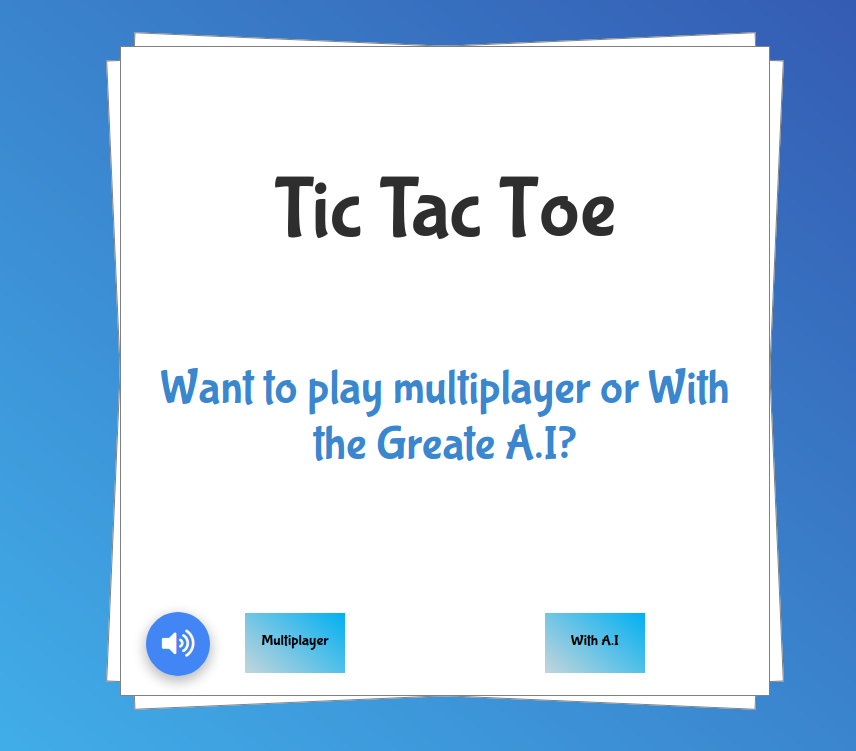
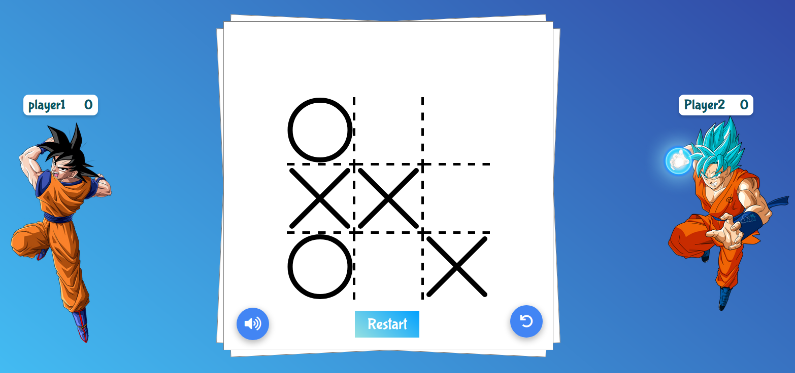
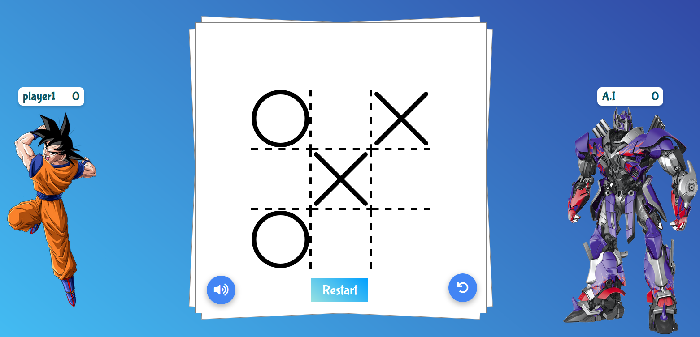

# Tic Tac Toe

This is a complete and an awesome **_Tic Tac Toe_** game, with a great design and all the necessary features you could think of (check [Features](#features) for more details).

**_Artificial Intelligence_**: To create the **_AI_** for this game I used the [Mini-Max](https://www.javatpoint.com/mini-max-algorithm-in-ai) algorithm, a recursive or backtracking algorithm which is used in decision-making and game theory.

> **Home page**
# 

## Table of contents

1. [Features](#features)
2. [Development](#development)


## Features

- Single & multiplayer mode
- Three available difficulties in single player mode (Easy, Normal & Impossible)
- Restart game
- Save and display score
- Reset score
- Great sound effects
- Material design
- A cartoon game style design
- Cool CSS animations & SVG animations (board game, 'X' & 'O' marks)

> **_Game page vs player_**

# 

> **_Game page vs A.I_**

# 

## Development

To set up this App locally, clone this repo to your desktop using git and develop as you want!!


```diff
This game is still in development phase so some features mentioned above might not be there**
```